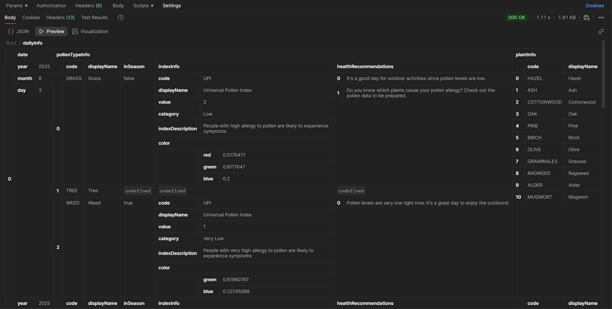
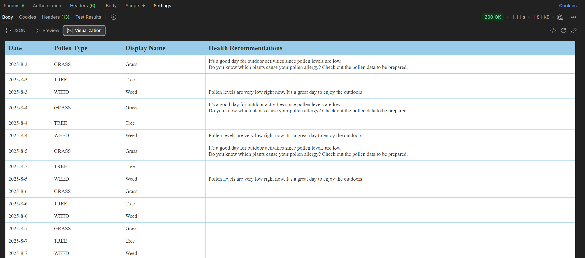

# 🌿 Google Pollen API Forecast Collector

This project fetches and stores pollen forecast data using the Google Pollen API for locations in Germany. It supports automated daily fetches and provides REST API endpoints for accessing the latest and historical data.

---

## 📊 Pollen Data Structure

This section outlines the structure of the stored JSON data.

### 🔑 Top-Level Keys

| Key            | Description                                                  |
|----------------|--------------------------------------------------------------|
| `regionCode`   | Country/region code (e.g., `"DE"` for Germany)               |
| `fetched_date` | Date when data was retrieved (e.g., `"2025-08-03"`)          |
| `dailyInfo`    | List of daily pollen forecasts                               |

---

### 📅 Inside `dailyInfo` (Per Day)

#### `date`
- `year`: Forecast year  
- `month`: Forecast month  
- `day`: Forecast day  

#### `pollenTypeInfo` (Pollen Categories)

| Key                    | Description                                            |
|------------------------|--------------------------------------------------------|
| `code`                 | Pollen type (e.g., `"GRASS"`, `"TREE"`, `"WEED"`)      |
| `displayName`          | Human-readable name (e.g., `"Grass"`)                 |
| `inSeason`             | Boolean (`true`/`false`) - Is it currently active?     |
| `indexInfo`            | Pollen severity metrics:                               |
| - `code`               | Index type (e.g., `"UPI"` = Universal Pollen Index)    |
| - `value`              | Numeric severity (1 = Very Low, 2 = Low, etc.)         |
| - `category`           | Text label (e.g., `"Low"`)                             |
| - `indexDescription`   | Impact on allergy sufferers                            |
| - `color`              | RGB values for visualization                           |
| `healthRecommendations` | Suggested actions for allergic individuals           |

---

### 🌱 `plantInfo` (Specific Plants)

| Key                    | Description                                             |
|------------------------|---------------------------------------------------------|
| `code`                 | Plant ID (e.g., `"GRAMINALES"`)                         |
| `displayName`          | Common name (e.g., `"Grasses"`)                         |
| `inSeason`             | Boolean (`true`/`false`)                                |
| `indexInfo`            | Same as `pollenTypeInfo.indexInfo`                      |
| `plantDescription`     | Detailed metadata:                                      |
| - `type`               | GRASS / WEED / TREE, etc.                               |
| - `family`             | Plant family (e.g., `"Poaceae"`)                        |
| - `season`             | Typical pollination season                              |
| - `crossReaction`      | Related plant/food allergy links                        |
| - `picture`            | URL to plant image                                      |
| - `pictureCloseup`     | URL to close-up plant image                             |

---

## 🚀 Features

- 🔄 Daily automated pollen data collection
- 🌍 Country/location-specific support
- 🧪 JSON file-based storage
- 🔗 REST API to retrieve:
  - Latest data (`/latest-json`)
  - All collected data (`/all-json`)
  - Last 5 days combined (`/fetch-5-days-combined`)

---

## 🛠 Tech Stack

- [FastAPI](https://fastapi.tiangolo.com/)
- [httpx](https://www.python-httpx.org/)
- [dotenv](https://pypi.org/project/python-dotenv/)
- JSON for structured storage

---


## 📌 Notes

- Requires `GOOGLE_POLLEN_API_KEY` in `.env`
- Currently configured for Germany (`LAT = 51.1657`, `LON = 10.4515`)
- Extendable to support multiple regions or file formats (CSV, etc.)
- This API only provides data for the last 5 days at a time (highest)
- You can change it by giving days a value of 1 to 5 

---

## 📸 Screenshots - Response Visualiser from Postman




## 🚀 Local Installation

```bash
# Clone the repository
git clone https://github.com/teamjaf/pollen-api/
cd pollen-api

# Create and activate a Python virtual environment
python -m venv venv
source venv/bin/activate  # On Windows use: venv\Scripts\activate

# Install dependencies
pip install -r requirements.txt

# Create .env file with your Google Pollen API key
echo "GOOGLE_POLLEN_API_KEY=your_api_key_here" > .env

# Start FastAPI server
uvicorn main:app --reload

# (Optional) Run the scheduler in a separate terminal
python scheduler.py

# When done:
# - Press Ctrl+C to stop the server
# - Deactivate the virtual environment
deactivate

# Exit terminal (if needed)
exit
```

## 📬 License

MIT License © 2025

